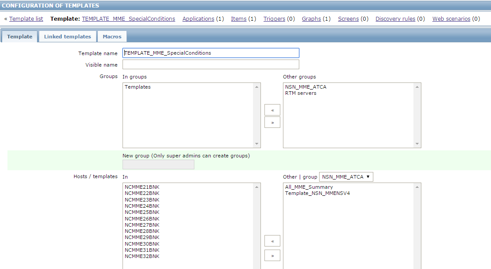

MMDU重复用户RTM监控安装部署指引
==========================

##1. 概述
本文所描述的RTM监控项在部署后可以自动收集FlexiNS MME的MMDU的用户IMSI信息，然后找出重复的用户IMSI；如果重复用户数超过预设的`delimsi_freshold`参数值，则使用预定义的命令集将这些用户从MME上删除。

##2.安装与配置

本安装包解压后包含以下安装文件和文档：

- rtmlibs.tgz
- dupimsi.tgz
- zbx_specialconditions_templates.xml
- DuplicatedIMSI_install_guide.pdf
- PyYAML-3.12.tar.gz

###2.1 安装库文件及建立相关目录

以**`root`**用户登录到RTM服务器上，执行以下操作：

 1. 建立临时安装目录：`~/tmp`
```bash
 [root@RTM ~]# mkdir tmp
```
 使用winscp或其他上传工具将库文件**`rtmlibs.tgz`**和脚本安装包**`dupimsi.tgz`**上传到`/root/tmp`目录下。

 2. 建立RTM库文件的安装目录: `/opt/RTM/pylibs`
```bash
 [root@RTM ~]# mkdir -p /opt/RTM/pylibs
```

 3. 将库文件解压到`/opt/RTM/pylibs`
```bash
[root@RTM ~]# tar -xzf tmp/rtmlibs.tgz -C /opt/RTM/pylibs
```

 4. 将库文件所在目录加入到系统路径中
```bash
[root@RTM ~]# echo "/opt/RTM/pylibs" > /usr/lib/python2.6/site-packages/rtmlibs.pth
```

 5. 建立specialconditions目录
```bash
[root@RTM ~]# mkdir -p /opt/RTM/specialconditions
[root@RTM ~]# chown -R zabbix:zabbix /opt/RTM/specialconditions
```

 6. 建立cache目录。此目录用于缓存脚本执行的log及删除用户的命令集文件。
```bash
[root@RTM ~]# ln -s /dev/shm /tmp/cache
[root@RTM ~]# mkdir /tmp/cache/log /tmp/cache/cmdfile
```

 7. （如果服务器上未安装PyYAML包）安装PyYAML包
```bash
[root@RTM ~]# tar -xzf tmp/PyYAML-3.12.tar.gz -C tmp/ 
[root@RTM ~]# cd tmp/PyYAML-3.12 
[root@RTM PyYAML-3.12]# python setup.py install
```

###2.2 安装监控脚本

所有的监控脚本和配置文件将会安装到`/opt/RTM/specialconditions/mme`目录下。

以**`zabbix`**用户登录到RTM服务器上执行以下命令：

1. 建立安装目录：`/opt/RTM/specialconditions/mme` 

   > 如果此目录已存在可以省略。
```bash
[zabbix@RTM ~]$ mkdir -p /opt/RTM/specialconditions/mme
```

2. 安装脚本到安装目录
```bash
[zabbix@RTM ~]$ tar -xvzf /root/tmp/dupimsi.tgz -C /opt/RTM/specialconditions/mme/
dupimsi/
dupimsi/delete_imsi
dupimsi/remote.cmd/
dupimsi/remote.cmd/dupimsi_DYMME21BNK.cmd
dupimsi/baseconfig.py
dupimsi/hosts_init.yml
dupimsi/dump_mmdu_imsi
dupimsi/purgeimsi.py
```

3. 检查脚本是否已经安装成功：
   成功安装脚本后，目录下应该包含以下文件和目录：
```bash
[zabbix@RTM ~]$ ll /opt/RTM/specialconditions/mme/dupimsi
total 24
-rw-r--r--. 1 zabbix zabbix 1936 Nov 28 11:41 baseconfig.py
-rwxr-xr-x. 1 zabbix zabbix 1826 Nov 28 11:42 delete_imsi
-rwxr-xr-x. 1 zabbix zabbix 2200 Nov 28 11:40 dump_mmdu_imsi
-rw-r--r--. 1 zabbix zabbix  327 Nov 27 23:16 hosts_init.yml
-rwxr-xr-x. 1 zabbix zabbix 3774 Nov 27 13:30 purgeimsi.py
drwxr-xr-x. 2 zabbix zabbix 4096 Nov 27 23:23 remote.cmd
```

###2.3 配置文件说明及修改

脚本安装完毕后，需要修改以下两个配置文件以符合现场的情况：

####2.3.1 基本配置文件：`baseconfig.py`
本配置主要包含一些系统及监控相关的基本配置信息。
```python
# -*- coding: utf-8 -*-
from rtm.netaccount import AccountFile
from rtm.utils import BasePath

####################### Paths Definition ##########################
# RTM installation base directory RTM安装根目录
RtmBase = BasePath("/opt/RTM")

# Network Element host account file 网元登录信息配置文件,保存在`RtmBase`目录下
HostsFile = RtmBase('/hosts.yml')

# Zabbix Config file diectory Zabbix的配置目录
ZabbixConfigBase = BasePath("/etc/zabbix")

#Zabbix bin files diectory Zabbix可执行文件所在目录(zabbix_sender等命令工具)
ZabbixBinBase = BasePath("/usr/bin")

# Zabbix ExternalScripts directory Zabbix外部脚本目录
ZabbixExtscriptBase = BasePath("/etc/zabbix/externalscripts")

#cache for log
CacheBase = BasePath("/tmp/cache")

############### config for purgeimsi.py #####################
class PurgeIMSIConfig():
    logging_level = logging.INFO
    logging_file = "/tmp/cache/purgeimsi.log"
    logfile_pattern = CacheBase('log/flexins_dupimsi_%s.log').fullpath
    delimsi_cmdfile_pattern = CacheBase('cmdfile/delimsi_%s.cmd').fullpath
    imsi_regex = "^\d+f\d"
    zbx_dupimsi_item_key = "dupimsi.counter"
    delimsi_freshold = 3	#启动删除用户命令的阀值
    delimsi_template ="""\  #删除用户的命令模板
ZMMD:IMSI=%(imsi)s:;
ZMMD:IMSI=%(imsi)s:;
"""
###################################################################
HostList = AccountFile(HostsFile.fullpath)
PathList = dict(
    RtmBase=RtmBase,
    MyBase=MyBase,
    HostsFile=HostsFile,
    ZabbixConfigBase=ZabbixConfigBase,
    ZabbixBinBase=ZabbixBinBase,
    ZabbixExtBase=ZabbixExtBase,
    CacheBase=CacheBase,
    )
 ~~~~~ 以下省略 ~~~~
```

其中：

- `RtmBase` 为`RTM安装目录`

- `HostsFile` 为保存网元登录信息的文件存放路径及文件名，一般不需要改变

    - `ZabbixConfigBase` 为`Zabbix配置目录`

    - `ZabbixBinBase` 为`Zabbix可执行程序所在目录`

    - `ZabbixExtscriptBase` 为`zabbix外部脚本目录`

    - `delimsi_freshold` 删除用户的阀值，但发现重复用户数超过这个值即运行删除用户脚本

    - `delimsi_template` 删除用户的命令模板。缺省是执行两次删除用户的操作。如果需要增加或
      调整删除用户的命令，可以修改此模板。


####2.3.2 网元信息初始配置文件：`hosts_init.yml`

此文件主要包含网元的主机名、ip地址、登录用户名及密码等信息。修改完毕并加密后，需要将此文件删除。

以下是一个示例：
```yaml
    ncmme21: #网元简称
       hostname: NCMME21BNK			#网元名称，与Zabbix内的网元名称一致
       _type:    HostAccount		#主机帐号
       ipaddr:   10.180.78.113		#管理IP地址
       username: RTMUSER			#用于自动登录网元的用户名
       password: "rtm@password2"	#登录用户的密码,注意要用双引号括起来
       conn_type: telnet			#网元登录方式

    ncmme22: #另外一个网元
       hostname: NCMME22BNK
       _type:    HostAccount
       ipaddr:   10.180.78.114
       username: RTMUSER
       password: "passw0rd2"
       conn_type: telnet
```
请将所有需要被监控的MME网元信息均加入到此文件内。添加完毕后，运行以下命令对此文件里的密码进行加密：
```bash
[zabbix@RTM ~]$ cd /opt/RTM/specialconditions/mme/dupimsi
[zabbix@RTM dupimsi]$ python -m rtm.netaccount encrypt_file hosts_init.yml > hosts.yml
```
执行命令后，将会生成一个hosts.yml文件，其中的密码已被加密。
```bash
[zabbix@RTM dupimsi]$ cat hosts.yml
dymme21:
  _type: HostAccount
  conn_type: telnet
  hostname: DYMME21BNK
  ipaddr: 10.180.78.113
  password: ==lSTlZWTkZVaXR5ZEcxQWNHRnpjM2R2Y21VbAUX
  username: RTMUSER
 ~~~~~ 以下省略 ~~~~
```
####2.3.3 收集MMDU数据库命令集文件：`dupimsi_hostname.cmd`

用于收集MMDU数据库信息的命令集文件，每个网元对应一个文件，文件名中的hostname将由网元在
RTM系统中定义的hostname来代替。如果网元的硬件配置都一样，则可以将该文件复制一份

目录/opt/RTM/specialconditions/mme/dupimsi/remote.cmds下提供了一个`dupimsi_DYMME21BNK.cmd`作
为例子，请将其修改成与实际网元的配置对应。

> **注意：**示例文件仅针对只有**6个MMDU**的设备，如果您的设备不是6个MMDU，请增加或减少相应的命令，
> 否则将导致收集的信息不够全面或出错。

> **注意：** 每个MME网元必须对应一个文件，文件名中的hostname将由网元在RTM系统中定义的hostname来代
> 替，也必须和`hosts.yml`中的`hostname`一致。

### 2.4 Zabbix配置
 1. 导入**Template_MME_SpecialConditions**的模板
     通过Zabbix的web页面，将`zbx_specialconditions_templates.xml`导入到Zabbix中，生成名为
     `Template_MME_SpecialConditions`模板。

 2. 将需要监控的MME link到`Template_MME_SpecialConditions`模板上，则MME将会增加一个
     `dupimsi.counter`的监控Item，表示最近 一次统计的重复用户数。

  </img>


##3. 测试
当脚本和配置都已完成部署后，需要对脚本进行测试。

> 注意：以下所有操作均以zabbix用户登录。

###3.1 测试MMDU数据库信息的收集

 收集MMDU数据库信息的脚本为`dump_mmdu_imsi`，输入以下命令运行该脚本（请将`DYMME21BNK`替换为实际的网元名称）：
```bash
[zabbix@RTM ~]$ cd /opt/RTM/specialconditions/mme/dupimsi
[zabbix@RTM dupimsi]$ ./dump_mmdu_imsi DYMME21BNK
```
> 注意：收集MMDU数据库信息的脚本需要用到expect工具环境，如果系统上未安装的话（运行脚本会报错），请使用	yum或rpm工具安装

运行完成后，检查是否生成包含MMDU用户信息的log：

```bash
[zabbix@RTM dupimsi]$ ll /tmp/cache/log
total 14368
-rwxrwxr-x. 1 zabbix zabbix 14705595 Nov  6 13:05 flexins_dupimsi_DYMME21BNK.log
```
如果能看到生成字节数比较大的flexins_dupimsi_xxx.log的文件，则说明脚本已能成功
取得MMDU的用户数据。

###3.2 测试统计用户信息脚本
统计MMDU用户信息的脚本为`purgeimsi.py`脚本，执行以下命令运行该脚本：

```bash
[zabbix@RTM ~]$ cd /opt/RTM/specialconditions/mme/dupimsi
[zabbix@RTM dupimsi]$ ./purgeimsi.py DYMME21BNK 
2016-11-28 16:00:30 zbxsender.py[41] INFO Update dupimsi.counter=133, Exit status code:0
```
以上运行结果显示统计出重复用户数为133个，Exit status Code为0表示已成功将该数值
更新到Zabbix数据库。可以登录到Zabbix Web页面的latest data查看当前`dupimsi.counter`
的数值是否与该数值一致。

检查`/tmp/cache/cmdfile`目录下是否已生成删除用户的命令集文件：

```bash
[zabbix@RTM dupimsi]$ ll /tmp/cache/cmdfile/
-rw-rw-r--. 1 zabbix zabbix 7448 Nov 28 16:06 delimsi_DYMME21BNK.cmd
[zabbix@RTM dupimsi]$ less /tmp/cache/cmdfile/delimsi_DYMME21BNK.cmd
```
同时用less命令查看命令集文件是否正确。

> **提示：**
> 运行 purgeimsi.py 时，如果在最后加上`go` 参数，purgeimsi.py脚本在做完统计后，如果重复
> 用户数大于baseconfig.py里预设的阀值，则会自动调用`delete_imsi`脚本执行删除用户的动作。
> 详情可以参考crontab里的命令

###3.3 测试删除用户脚本
 删除用户的脚本是`delete_imsi`，运行以下命令执行：
```bash
[zabbix@RTM dupimsi]$ ./delete_imsi DYMME21BNK
```
##4. 启动监控
因收集MMDU用户数的脚本运行时间比较长（大于30秒），因此只能通过crontab来控制脚本的自动定时执行。

安装包中已提供了一个crontab的配置文件例子`dupimsi.crontab`，每隔一小时对MME21和MME22进行监控
及删除用户。可以根据需要修改并上传到服务器上，然后让crontab读入此文件作为配置。

以zabbix用户登录系统，执行以下命令：

```bash
[zabbix@RTM dupimsi]$ crontab dupimsi.crontab 
[zabbix@RTM dupimsi]$ crontab -l  #查看是否已成功读入
#Dump MMDU IMSI and then find&delete the duplicated IMSI.

##cron job for duplicated IMSI issue DYMME21BNK
7 * * * * /opt/RTM/specialconditions/mme/dupimsi/dump_mmdu_ims DYMME21BNK >/dev/null 2>&1
9 * * * * /opt/RTM/specialconditions/mme/dupimsi/purgeimsi.py DYMME21BNK go

##cron job for duplicated IMSI issue DYMME22BNK
12 * * * * /opt/RTM/specialconditions/mme/dupimsi/dump_mmdu_ims DYMME22BNK >/dev/null 2>&1
14 * * * * /opt/RTM/specialconditions/mme/dupimsi/purgeimsi.py DYMME22BNK go
```